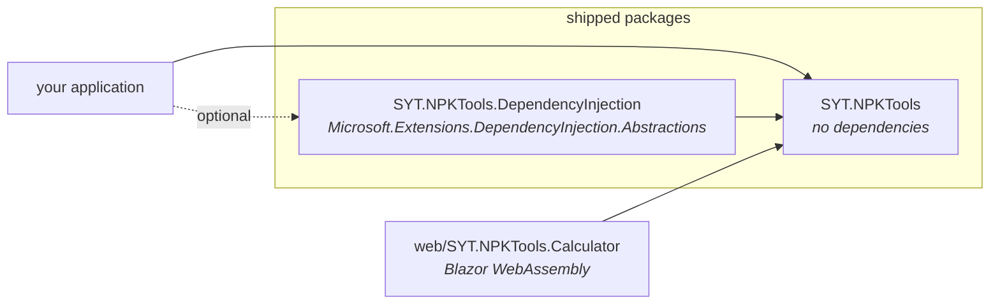
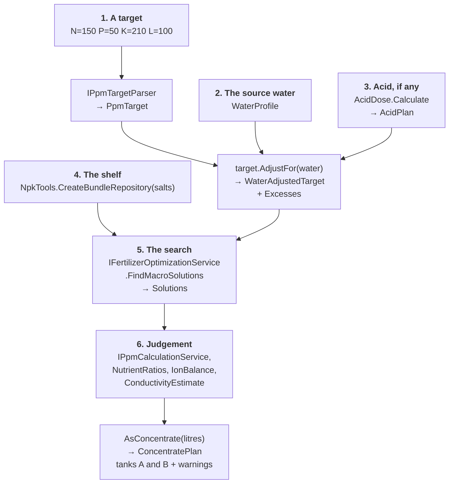
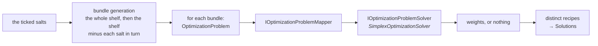
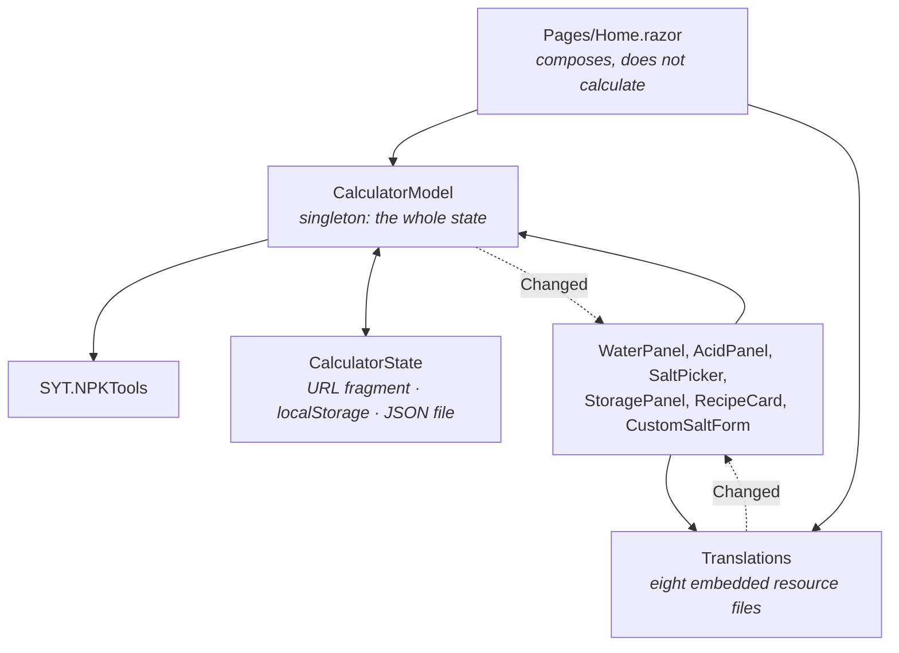

# How SYT.NPKTools is put together

The library answers one question — *what do I weigh out to hit this nutrient profile in this much
water?* — and everything in it is either part of answering that or part of telling you whether to trust
the answer.

This document is the map. For what the pieces do, the XML documentation on each public type is the
authority and ships in the package for IntelliSense; for how to use them, see the
[README](../README.md).

## The shape of it

Two packages, and one of them exists so the other can have no dependencies at all.

`SYT.NPKTools` referencing nothing is the constraint that makes everything else possible: it is why the
whole optimizer runs in a browser tab with no server, and why the calculator is a static site. The
dependency-injection helpers are separate for exactly that reason — a consumer who wants
`AddNpkTools()` takes the second package, and one who does not takes nothing.

## The pipeline

A recipe is produced in six steps. The calculator app runs all of them whenever an input is committed —
the fields use `@onchange`, so on blur or Enter rather than on every keystroke — and a library caller can
stop after any of them.

**Step 2 is the one other calculators skip.** Whatever the water already supplies is subtracted from the
target before the optimizer ever sees it, and anything the water oversupplies is reported as an
`Excess` rather than silently ignored — fertilizer only adds, so no recipe can bring calcium down once
the water has 160 ppm of it. Saying so is the useful behaviour.

**Step 3 folds into step 2 on purpose.** An acid's nitrogen, phosphorus or sulfur is in the reservoir
exactly as the water's is, so the acid is added to the water profile the recipe is solved against and
reported in the tank contents. Getting this wrong understates the tank by the whole dose, which is how
it was caught: a target of 150 ppm N reported 121.

## Inside the search

`FindMacroSolutions` is not one linear program. It is one per *bundle* — a subset of the shelf — and the
bundles are generated from what you ticked.

Three consequences worth knowing before changing anything here:

- **Coverage is reported, not enforced.** `UncoveredElements` names what nothing on the shelf supplies,
  and it is shown when no recipe was found — but it is advisory. No filter disqualifies a bundle for
  missing an element, and a two-salt shelf does solve a target that does not mention the others. What makes
  a small shelf fail is that `RangeFactor` defaults to 1 — the tightest it goes — which turns every element
  the target names into an exact equality: the mix is over-constrained rather than disqualified. *Lower* the
  factor and shelves that "cannot" solve begin to. An element the target never mentions is unconstrained;
  one you set to zero is pinned to zero.
- **Bundles are not combinations.** The generator takes the whole shelf, then the shelf minus each salt in
  turn, capped by `MaxBundles`. That is `n + 1` linear programs for `n` salts, not `2ⁿ` — which is why the
  search is fast enough to run on every edit, and why it is not exhaustive.
- **The default solver is fully managed.** `SimplexOptimizationSolver` is why this runs in WebAssembly.
  `IOptimizationProblemSolver` is a seam: the differential tests substitute OR-Tools and check the two
  agree, which is how the managed one earns trust.
- **The search can take a noticeable time**, because it is a linear program per bundle. Every
  `Find…` method takes a `CancellationToken`.

## Namespaces, and what lives where

| Namespace | What it holds |
|---|---|
| `SYT.NPKTools` | `NpkTools` — the static factory that is the whole entry point — plus `Solution`, `Solutions`, the curated catalogue, the bundle repositories and both service interfaces |
| `SYT.NPKTools.Nutrients` | the domain: `Ppm`, `PpmTarget`, `WaterProfile`, `Acid`, `AcidDose`, `ElementGroups`, `NutrientRatios`, `IonBalance`, conductivity |
| `SYT.NPKTools.Fertilizers` | what a salt is: `Fertilizer`, `FertilizerBuilder`, `ChemicalFormula`, `FormulaComposition` |
| `SYT.NPKTools.Optimization` | the search: contracts, the simplex solver, the problem mapper, settings |
| `SYT.NPKTools.Concentrates` | A/B tanks, solubility, saturation, `ConcentratePlan` and its warnings |
| `SYT.NPKTools.Internal` | not public API; do not reach into it |

**Folder names are not namespaces here.** The files under `Presets/` and `Optimization/Contracts/`
declare `namespace SYT.NPKTools` and `namespace SYT.NPKTools.Optimization`; a `<see cref="..."/>` written
from the folder path will not compile.

Seven public interfaces: `IPpmTargetParser`, `IPpmCalculationService`, `IFertilizerOptimizer`,
`IFertilizerOptimizationService`, `IFertilizerBundleRepository`, `IOptimizationProblemMapper`,
`IOptimizationProblemSolver`. Six are reachable through `NpkTools`; the exception is
`IOptimizationProblemMapper`, which `CreateOptimizer` constructs itself with no overload to pass one, so
substituting a mapper means building `FertilizerOptimizationAdapter` directly.

## Two design rules that explain most of the code

**A value object rather than a `double`.** `Ppm`, `Weight`, `Liters`, `Percent` and the rest exist so
that a number cannot arrive in the wrong slot. This is verbose and it is the point: the failure it
prevents — grams where litres were meant — produces a plausible recipe rather than an exception.

**A figure that comes from the physical world carries its provenance.** The EC model is checked against
certified KCl conductivity standards, the solubility table against published handbook values, the atomic
masses against IUPAC. Where a figure could not be sourced, the code says so and the app reports it as
unknown — `ConcentratePlan.UnknownSolubility` exists because "no published figure" is different from
"fine", and a ceiling computed without it may be lower than it looks.

## The browser app

`web/SYT.NPKTools.Calculator` is a reference application as much as a product: it demonstrates that the
library runs client-side with no backend at all.

The two dotted edges are not decoration. **Blazor does not re-render a child component whose parameters
have not changed**, and every panel takes one parameter — a callback to the same method on the page,
equal on every pass. So the model and the translation store each raise an event.
`WaterPanel`, `AcidPanel`, `SaltPicker` and `StoragePanel` listen to both, because they display computed
results; `RecipeCard` and `CustomSaltForm` listen for the language only, since their content arrives as
parameters or is local to the form. Without the first, the acidification card never appeared at all; without the second, a
language change redrew the header and nothing else. Both shipped broken before they were measured.

State lives in one singleton and travels three ways, each answering a different question: the URL
fragment moves a setup to another device, `localStorage` survives closing the tab, and a JSON file
survives clearing site data. There is no server, so there is nothing else it could be.

## Where to read next

- [README](../README.md) — what each capability is for, with worked examples
- [CONTRIBUTING](../CONTRIBUTING.md) — the conventions, and how an interface change is verified
- [`docs/faq.md`](faq.md) — the questions the numbers raise
- [`docs/superpowers/glossary-hydroponics.md`](superpowers/glossary-hydroponics.md) — the terminology,
  per language, with sources and with the gaps marked
